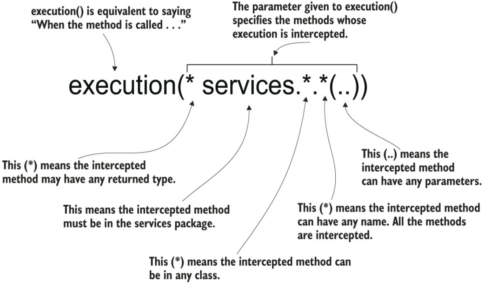

# Aspects

## Weaving

It's the approach when you create a aspect for a method, and when you instantiate the object, you get a proxy object, an object that references the object that you want. (That object manages the logic for the aspect).

# Advice annotations
## @Around

This is a "AspectJ pointcut language"

You can use custom annotations for it too

## Specific
@Before
@AfterReturning
@AfterThrowing
@After